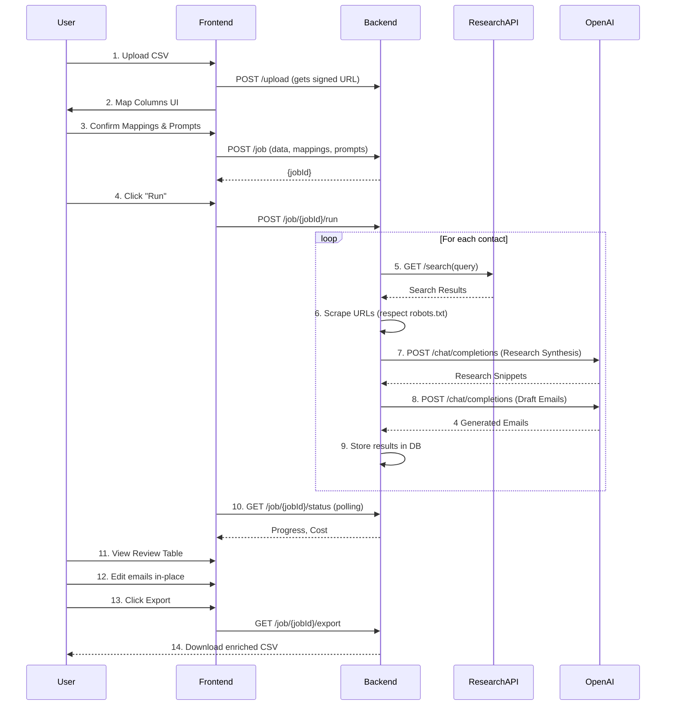

# Product Requirements Document: ColdForge

**Author:** Jules, Senior Product Manager + Technical Architect
**Version:** 1.0
**Date:** 2023-10-27

---

## Assumptions & Variables

| Variable              | Value                                                                             | Assumption                                                                                             |
| --------------------- | --------------------------------------------------------------------------------- | ------------------------------------------------------------------------------------------------------ |
| **[APP_NAME]**            | “ColdForge”                                                                       | N/A (Default)                                                                                          |
| **[TARGET_USER]**         | “Solo founders, SDRs, indie marketers”                                            | N/A (Default)                                                                                          |
| **[BUILD_PLATFORM]**      | **Primary:** Next.js + Vercel Free Tier. **Fallback:** Google Sheets + Apps Script. | A full-stack app provides better UX and scalability, while the fallback ensures ultra-low cost/effort. |
| **[OPENAI_MODEL]**        | “gpt-4o-mini”                                                                     | This model offers the best balance of cost, speed, and quality for this task.                          |
| **[RESEARCH_API]**        | **Primary:** [Tavily](https://tavily.com/) for search. **Secondary:** Manual URL paste. | Tavily is chosen for its simple API and fast results. A manual option is a crucial fallback. |
| **[BUDGET_CAP_USD]**      | 10                                                                                | Per month. This cap forces extreme efficiency in API usage.                                            |
| **[MAX_ROWS]**            | 2,000                                                                             | Per single upload/run. This balances utility with browser/serverless function memory limits.           |
| **[TONE]**                | “Helpful, concise, non-salesy”                                                    | N/A (Default)                                                                                          |
| **[FOLLOWUP_STRATEGY]**   | “3 timed follow-ups that add value (new angle, resource, case snippet)”           | N/A (Default)                                                                                          |
| **[INPUT_COLUMNS]**       | FirstName, LastName, Email, Company, Title, WebsiteOrProfileURL, Notes            | These are the most common fields for personalization. The app will allow mapping custom column names.  |
| **[OUTPUT_COLUMNS]**      | Email_Original, FollowUp_1, FollowUp_2, FollowUp_3, Research_Snippets, Source_URLs | These columns are appended to the original uploaded data.                                              |

---

## 1. Executive Summary

ColdForge is a lightweight, privacy-focused web application designed to help sales professionals, founders, and marketers automate the most time-consuming part of cold outreach: research and first-drafting.

-   **What it does:** Users upload a spreadsheet of contacts (CSV/XLSX), and the app enriches it by performing web research and generating a personalized outreach email and three value-added follow-ups for each contact using AI.
-   **Who it's for:** [TARGET_USER] who need to send personalized outreach at scale without the high cost of existing sales automation platforms.
-   **The "cheap to run" angle:** The architecture is optimized for free/hobby tiers (Vercel, Supabase) and low-cost APIs ([OPENAI_MODEL], [RESEARCH_API]), with a hard budget cap to prevent surprise bills. The user brings their own API keys.
-   **MVP Boundary:** The app's scope is strictly limited to research and draft generation. It **does not** send emails, connect to CRMs, or manage campaigns. It is a "bring your own data, take your own data" tool.

---

## 2. Goals, Non-Goals & Success Metrics

### Goals
-   **Speed:** Process a 100-contact list in under 5 minutes.
-   **Personalization Quality:** Generated emails should be high-quality enough to require minimal ( < 25%) manual editing before sending.
-   **Privacy:** All processing is done in-memory or in the user's own database instance. No user data is stored on ColdForge servers by default. PII is handled ephemerally.
-   **Cost-Effectiveness:** The entire monthly operational cost must stay below **$[BUDGET_CAP_USD]** for a typical user on free hosting/database tiers.

### Non-Goals (for MVP)
-   **Email Sending:** The app will not send emails or connect to email service providers.
-   **CRM Synchronization:** No integration with Salesforce, HubSpot, or other CRMs.
-   **Campaign Management:** No tracking of replies, bounces, or sequences.
-   **Contact Discovery:** The app does not find new leads; it only enriches existing lists.

### Success Metrics
| Metric                          | Target                                    | Measurement Method                                          |
| ------------------------------- | ----------------------------------------- | ----------------------------------------------------------- |
| **Cost per 100 Contacts**       | < $0.50                                   | (OpenAI cost + Research API cost) / (contacts processed / 100) |
| **Time per 100 Contacts**       | < 5 minutes                               | Timing the end-to-end job from upload to export availability. |
| **Manual Edit Rate**            | < 25% of generated emails need edits      | User survey or sampling of generated vs. final text.        |
| **Reply-Rate Proxy (Optional)** | Establish a baseline for user case studies | Users can optionally report back on campaign success.         |

---

## 3. Personas & Primary Use Cases

### Personas
1.  **Sam, the Solo Founder:** Needs to contact 50 potential investors. Has a curated list in a spreadsheet. Wants to send highly personalized emails but lacks the time to research each investor individually. Values quality over quantity.
2.  **Dana, the SDR:** Has a list of 200 leads from a conference. Needs to send initial outreach and follow-ups. Her quota is tied to meetings booked. Wants to automate the "busy work" of drafting so she can focus on conversations.
3.  **Alex, the Indie Marketer:** Needs to reach out to 100 potential partners for a new affiliate program. Wants to add a personal touch by referencing their recent work or company news.

### Primary Use Cases
1.  **Happy Path (Bulk Personalization):**
    -   Dana uploads her 200-contact CSV.
    -   She maps her `Name` column to `FirstName` and `Company Name` to `Company`.
    -   She reviews the default prompts and slightly tweaks the "Call to Action" in the original email template.
    -   She enters her API keys and sets a budget cap of $5.
    -   She clicks "Run." The app shows a progress bar, live logs, and a running cost estimate.
    -   After 8 minutes, the job completes. She reviews the generated emails in a table view, makes minor edits to 15 of them, and then exports the enriched CSV.
    -   She now has her original spreadsheet with 6 new columns, ready to be used in her sending tool.

2.  **Review Before Export (Investor Outreach):**
    -   Sam uploads his 50-investor list.
    -   For a few high-value investors, the automated research missed their personal blog. Sam manually pastes the blog URL into the `WebsiteOrProfileURL` field for those rows.
    -   He runs the generation process.
    -   In the review table, he carefully edits each of the 50 original emails to be perfect. For one investor, he dislikes the generated angle, so he edits the `Research_Snippets` for that row and clicks "Regenerate Row." The app re-drafts just that one email based on his new input.
    -   Once satisfied, he exports the file.

---

## 4. User Stories w/ Acceptance Criteria (Gherkin)

### Story 1: User uploads and maps a contact list

```gherkin
Feature: Contact List Upload and Column Mapping

  Scenario: Successful CSV upload and mapping
    Given I am on the "Upload" page
    When I upload a valid CSV file with columns "First Name", "Company", and "Website"
    Then I should be taken to the "Map Columns" screen
    And the system should automatically suggest mapping "First Name" to "FirstName" and "Company" to "Company"
    When I map "Website" to "WebsiteOrProfileURL"
    And I confirm the mapping
    Then my data should be validated and ready for the next step.

  Scenario: Handling malformed CSV
    Given I am on the "Upload" page
    When I upload a CSV file with inconsistent column counts
    Then I should see an error message: "File is malformed. Please ensure all rows have the same number of columns."
    And I should remain on the "Upload" page.
```

### Story 2: User configures prompts

```gherkin
Feature: Prompt Configuration

  Scenario: User edits a global prompt template
    Given I am on the "Prompts Editor" screen
    And I see four default prompt templates for "Original Email", "Follow-Up 1", "Follow-Up 2", and "Follow-Up 3"
    When I edit the "Original Email" prompt to change the call to action
    And I click "Save Prompts"
    Then the system should use my updated prompt for all email generations in this run.
    And a preview should show the updated prompt with placeholder variables filled from the first row of my data.
```

### Story 3: User runs the research and generation job

```gherkin
Feature: Job Execution and Monitoring

  Scenario: User starts a job and monitors progress
    Given I have uploaded data and configured my prompts
    And I have entered my API keys and set a budget cap of $10 on the "Settings" page
    When I click the "Run Generation" button
    Then I should be taken to the "Run" screen
    And I should see a progress bar indicating the percentage of rows processed
    And I should see a live cost estimator that updates periodically
    And I should see a log of activities, like "Researching 'Jane Doe' at 'Acme Corp'..."

  Scenario: Job pauses when budget threshold is hit
    Given a job is running with a budget cap of $5
    When the estimated cost of the job exceeds $4.95
    Then the job should automatically pause
    And I should see a notification: "Job paused. Budget limit of $5.00 is about to be reached."
    And I should be given the option to "Stop and Export" or "Increase Budget and Resume".
```

### Story 4: User reviews, edits, and exports results

```gherkin
Feature: Review, Edit, and Export

  Scenario: User edits a generated email and exports the final sheet
    Given a generation job has completed successfully
    When I navigate to the "Review Table" screen
    Then I should see my original data alongside the new columns: "Email_Original", "FollowUp_1", etc.
    When I click into the "Email_Original" cell for "John Smith" and edit the text
    And I click "Export to CSV"
    Then a CSV file should be downloaded
    And the file should contain my original data plus the new columns, with my edited text for John Smith's email.

  Scenario: User regenerates a single row
    Given I am on the "Review Table" screen
    And I am not satisfied with the generated emails for "Jane Doe"
    When I edit the "Research_Snippets" for Jane's row to include a new fact
    And I click the "Regenerate Row" button for that row
    Then only the four email columns for Jane's row should be updated based on the new snippets
    And the rest of the table should remain unchanged.
```

---

## 5. Data Model & File Schema

### Input Schema (User Upload)
The user can upload a CSV/XLSX. The system will parse it into a JSON array of objects. A mapping UI will associate user column names with the internal schema.

| Internal Field Name   | Type   | Required? | Description                                      | Example Mapping         |
| --------------------- | ------ | --------- | ------------------------------------------------ | ----------------------- |
| `FirstName`           | String | **Yes**   | Contact's first name.                            | `First Name`, `givenName` |
| `LastName`            | String | Optional  | Contact's last name.                             | `Last Name`, `sn`       |
| `Email`               | String | Optional  | Contact's email. Used for reference, not sending. | `Email`, `email_address` |
| `Company`             | String | **Yes**   | Contact's current company.                       | `Company`, `Organization` |
| `Title`               | String | Optional  | Contact's job title.                             | `Title`, `Job Title`    |
| `WebsiteOrProfileURL` | String | **Yes**   | URL to research (e.g., company site, LinkedIn).  | `Website`, `URL`        |
| `Notes`               | String | Optional  | Any additional notes to be used in prompts.      | `Notes`, `Comment`      |

### Output Schema (Appended to Original)
The exported file will be the original file with these columns appended.

| Column Name         | Type   | Description                                                              |
| ------------------- | ------ | ------------------------------------------------------------------------ |
| `Email_Original`    | String | The first generated outreach email.                                      |
| `FollowUp_1`        | String | The first follow-up email.                                               |
| `FollowUp_2`        | String | The second follow-up email.                                              |
| `FollowUp_3`        | String | The third follow-up email.                                               |
| `Research_Snippets` | String | Bulleted list of facts found during research (e.g., "- Raised $10M..."). |
| `Source_URLs`       | String | Comma-separated list of URLs where research facts were found.            |

### Prompt Templates Schema (`prompts` table/document)

```json
{
  "id": "prompt_123",
  "name": "Original Email", // e.g., "Original Email", "Follow-Up 1"
  "role": "system", // or "user", "assistant"
  "template": "Subject: Quick question about {company}\n\nHi {first_name},\n\nI saw that {company} recently {recent_fact}. I'm reaching out because we help companies like yours with {pain_point} by providing {value_prop}.\n\n{cta}\n\nBest,\n[Your Name]",
  "variables": ["first_name", "company", "recent_fact", "pain_point", "value_prop", "cta"],
  "temperature": 0.7,
  "max_tokens": 500,
  "last_updated": "2023-10-27T10:00:00Z"
}
```

### Settings Schema (`settings` store)

```json
{
  "user_id": "user_abc",
  "openai_api_key": "sk-...", // Encrypted at rest
  "research_api_key": "tavily_...", // Encrypted at rest
  "budget_cap_usd": 10,
  "model": "gpt-4o-mini",
  "concurrency": 5, // Number of parallel requests
  "max_rows": 2000,
  "retry_policy": {
    "attempts": 3,
    "backoff_factor": 2
  }
}
```

---

## 6. Prompt System & Personalization Logic

The system uses a two-stage process: **Research → Synthesize → Draft**.

### A) Research → Synthesis Prompt
This first LLM call synthesizes raw web content into concise facts.

```
System: You are a research assistant. Your task is to extract 3-5 key, recent, and relevant facts about a person and their company from the provided text. Focus on news, achievements, product launches, or stated goals. Present them as a bulleted list. Be factual and concise. Cite your sources.

User:
Content from {Source_URL_1}: [scraped text from company About page]
Content from {Source_URL_2}: [scraped text from a news article]
...

Persona: {first_name}, {title} at {company}

Extract 3-5 relevant facts.
```

The output of this is stored in **`Research_Snippets`** and **`Source_URLs`**.

### B) Email Drafting Prompts
These prompts use the synthesized facts to draft the emails.

**Variable Definitions:**
-   `{first_name}`: Contact's first name.
-   `{company}`: Contact's company name.
-   `{title}`: Contact's title.
-   `{research_snippets}`: Bulleted list generated by the research prompt.
-   `{value_prop}`: A short sentence provided by the user describing what they offer.
-   `{cta}`: A call-to-action provided by the user (e.g., "Would you be open to a brief chat next week?").
-   `{tone}`: The desired tone, e.g., "[TONE]".
-   `{sender_name}`: The user's name.
-   `{sender_company}`: The user's company.

#### **Template 1: Original Email**
```
System: You are an expert cold outreach copywriter. Your tone is [TONE]. Write a short, personalized email. Use the research provided to make a relevant opening. Do not invent facts.

User:
**Contact Info:**
- Name: {first_name}
- Company: {company}
- Title: {title}

**Research Snippets:**
{research_snippets}

**My Offer:**
- My Value Prop: {value_prop}
- My Call to Action: {cta}
- My Name: {sender_name}
- My Company: {sender_company}

Draft a compelling, concise, and non-salesy outreach email. The subject line should be short and relevant.
```

#### **Template 2: Follow-Up 1 (New Angle)**
```
System: You are an expert cold outreach copywriter. Your tone is [TONE]. Write a brief follow-up email. Reference the previous email's topic but introduce a new angle or benefit. Do not repeat yourself.

User:
**Original Email's Topic:** Based on {research_snippets}, I proposed {value_prop}.

**New Angle:** Focus on a different aspect of the value prop or a surprising statistic related to their industry.

**Contact Info:**
- Name: {first_name}

**My Offer:**
- My Call to Action: {cta}
- My Name: {sender_name}

Draft a short follow-up email. Keep it under 75 words.
```

#### **Template 3: Follow-Up 2 (Provide Value)**
```
System: You are an expert cold outreach copywriter. Your tone is [TONE]. Write a brief follow-up that provides value with no ask. Share a helpful resource, a link to an insightful article, or a relevant case study snippet.

User:
**Context:** This is the third email in a sequence.

**Contact Info:**
- Name: {first_name}

**Value to Provide:**
- Resource Idea: A link to a blog post about solving [problem related to value prop].
- Case Snippet: "One of our clients in a similar space saw a 20% increase in efficiency..."

**My Name:** {sender_name}

Draft a short, helpful follow-up email with no direct call to action. The goal is to build trust.
```

#### **Template 4: Follow-Up 3 (Break-up/Last Try)**
```
System: You are an expert cold outreach copywriter. Your tone is [TONE]. Write a final, polite follow-up email. Acknowledge they are busy and state this is the last time you'll reach out on this topic. Keep it professional and brief.

User:
**Context:** This is the final email in a sequence.

**Contact Info:**
- Name: {first_name}

**My Offer:**
- My Call to Action: A soft CTA like "If this is a priority later, feel free to reach out."
- My Name: {sender_name}

Draft a respectful closing email.
```

### Editing UX
-   **Global Editor:** A dedicated screen shows the 4 prompt templates in text areas for editing before a run.
-   **Per-Row Override:** In the "Review Table," each generated email is in a `contenteditable` `<div>` or `<textarea>`.
-   **Regenerate:** A "Regenerate" button per row re-runs the drafting prompt for that row using the current `Research_Snippets` and global prompt template.
-   **Diff View (V2):** A future version could show a diff of the original vs. edited text.

---

## 7. Research Strategy (Compliant & Cheap)

1.  **API-First:** For each contact, the primary source is the `WebsiteOrProfileURL`. If it's a root domain (e.g., `acme.com`), the system will try to find "About Us", "Newsroom", or "Blog" pages.
2.  **Web Search Fallback:** If `WebsiteOrProfileURL` is not specific enough, use the [RESEARCH_API] with a query like `"{company}" news OR funding OR "about us"`.
3.  **Compliance:**
    -   The HTTP client will have a User-Agent string like `ColdForge/1.0 (Research Bot; +http://[APP_URL]/research-policy)`.
    -   The app will respect `robots.txt`.
    -   No scraping of sites requiring login (e.g., LinkedIn profiles). The user can paste public content from these sites manually.
4.  **Cost Control:**
    -   **Caching:** Raw content from a given URL is cached for the duration of a run to avoid re-fetching the same page for multiple contacts at the same company.
    -   **Summarization:** The raw HTML is stripped to text, and only the first ~8000 tokens are sent to the "Research → Synthesis" prompt to keep a lid on costs.
5.  **Output:** The results are stored in `Research_Snippets` (the bulleted list from the LLM) and `Source_URLs` (the URLs that were successfully fetched and used).

---

## 8. End-to-End Workflow & UX Flows

### Screens

1.  **Upload & Map Columns:**
    -   **UI:** A large file dropzone. Upon upload, it shows a preview of the first 5 rows and dropdowns to map user columns to system fields (`FirstName`, `Company`, etc.).
    -   **ASCII Wireframe:**
        ```
        +--------------------------------------------------+
        | ColdForge - Step 1: Upload & Map                 |
        +--------------------------------------------------+
        | [ Drag & Drop your CSV/XLSX here or Click to Upload ] |
        |                                                  |
        | --- Mapping ---                                  |
        | Your Column       | ColdForge Field              |
        | "First Name" ->   | [FirstName v]                |
        | "Company"    ->   | [Company   v]                |
        | "Website"    ->   | [WebsiteOrProfileURL v]      |
        | ...                                              |
        | [Next: Edit Prompts ->]                          |
        +--------------------------------------------------+
        ```

2.  **Prompts Editor:**
    -   **UI:** Four collapsible text areas, one for each prompt (Original, F1, F2, F3). A preview pane shows the rendered prompt using data from the first contact.
    -   **ASCII Wireframe:**
        ```
        +--------------------------------------------------+
        | ColdForge - Step 2: Prompts                      |
        +--------------------------------------------------+
        | [Original Email v] [Follow-Up 1] [Follow-Up 2]   |
        | +----------------------------------------------+ |
        | |System: You are an expert...                  | |
        | |User: ...Hi {first_name}, I saw...            | |
        | +----------------------------------------------+ |
        | --- Variables ---                                |
        | {value_prop}: [________________]                 |
        | {cta}:        [________________]                 |
        | [Next: Run ->]                                   |
        +--------------------------------------------------+
        ```

3.  **Run:**
    -   **UI:** A clean screen showing a progress bar, a running total of contacts processed, an estimated cost, and a read-only log view.
    -   **ASCII Wireframe:**
        ```
        +--------------------------------------------------+
        | ColdForge - Step 3: Running...                   |
        +--------------------------------------------------+
        | Processing... 78 / 200 (39%)                     |
        | [|||||||||||||||...........]                     |
        |                                                  |
        | Estimated Cost: $0.31                            |
        | [Pause] [Stop & Export]                          |
        | --- Logs ---                                     |
        | [INFO] Researching Jane Doe at Acme.com...       |
        | [INFO] Generating drafts for Jane Doe...         |
        | [WARN] Timeout for acme.com/blog, retrying...    |
        +--------------------------------------------------+
        ```

4.  **Review Table:**
    -   **UI:** A spreadsheet-like view. Original columns are read-only. New columns are editable. Filters for "Needs Attention" (e.g., rows with errors).
    -   **ASCII Wireframe:**
        ```
        +--------------------------------------------------------------------+
        | ColdForge - Step 4: Review & Edit                  [Export CSV]    |
        +--------------------------------------------------------------------+
        | Filter: [All v] | Search: [________]                               |
        |--------------------------------------------------------------------|
        | FirstName | Company | Email_Original (editable) | ... | Actions    |
        |-----------|---------|---------------------------|-----|------------|
        | John      | Piped   | Hi John, I saw...         | ... | [Regen Row]|
        | Jane      | Acme    | Hi Jane, congrats on...   | ... | [Regen Row]|
        +--------------------------------------------------------------------+
        ```

5.  **Settings:**
    -   **UI:** Simple form with fields for API keys, budget cap, and other parameters.
    -   **ASCII Wireframe:**
        ```
        +--------------------------------------------------+
        | ColdForge - Settings                             |
        +--------------------------------------------------+
        | --- API Keys ---                                 |
        | OpenAI API Key:     [sk-******************] [Save]|
        | Research API Key:   [tavily_************] [Save]|
        |                                                  |
        | --- Controls ---                                 |
        | Budget Cap (USD): [10.00]                          |
        | Concurrency:      [5]                              |
        | [Save Settings]                                  |
        +--------------------------------------------------+
        ```

### Mermaid Sequence Diagram



---

## 9. Architecture

### Track A (Primary): Next.js + Vercel + Supabase
This is the recommended path for a robust, scalable, and professional-feeling application.

-   **Frontend:** Next.js with App Router. Hosted on Vercel. Static pages for marketing, dynamic for the app itself.
-   **Backend:** Vercel API Routes (Serverless Functions) for handling API requests.
-   **Database:** Supabase Free Tier (PostgreSQL) for storing user settings, prompt templates, and job metadata/results. Its generous free tier is sufficient for the MVP.
-   **Job Queue:** For simplicity in MVP, processing can be done in a long-running serverless function (max 5 mins on Vercel Pro, shorter on Free). For longer jobs, use Vercel Cron to trigger a function that processes a small batch of contacts from the database queue, or a simple in-memory queue for the duration of the request.
-   **State Management:** React hooks, Zustand, or Jotai for client-side state.

**Pros:**
-   Excellent DX (Developer Experience).
-   Scales automatically.
-   Professional, fast UX.
-   Vercel's free tier is very generous.

**Cons:**
-   More complex setup than Track B.
-   Potential for hitting serverless function execution time limits on large jobs.

**Estimated Cost (per 1k contacts):**
-   **Vercel:** $0 (Free Tier)
-   **Supabase:** $0 (Free Tier)
-   **API Costs:** ~$2.50 (see Cost Model section)
-   **Total:** **~$2.50**

### Track B (Fallback): Google Sheets + Apps Script
This is the ultra-low-cost, no-hosting-required alternative.

-   **Frontend:** A Google Sheet serves as the database and UI.
-   **Backend:** Google Apps Script (`.gs` files) attached to the sheet.
-   **UI:** Custom menus (`ColdForge > Run Research`) and HTML Service sidebars for settings and prompts.
-   **Data Storage:** All data lives and stays within the user's Google Sheet. Settings are stored in `PropertiesService`.
-   **Execution:** Apps Script triggers run the functions. Subject to Google's execution time limits (6 mins/invocation).

**Pros:**
-   Zero hosting/database cost.
-   Extremely high user trust (data never leaves their Google account).
-   Simple to develop and deploy for a single developer.

**Cons:**
-   Clunky UI/UX.
-   Slower execution and stricter platform limits.
-   High lock-in to the Google ecosystem.
-   Concurrency is difficult to manage.

**Estimated Cost (per 1k contacts):**
-   **Google Workspace:** $0 (for personal accounts)
-   **API Costs:** ~$2.50
-   **Total:** **~$2.50**

---

## 10. API Design (for Track A)

-   **Authentication:** Simple API key or JWT-based auth for user sessions.
-   **Base URL:** `/api/v1`

**Endpoints:**
-   `POST /upload`: Not a direct upload. Returns a signed URL (e.g., to S3/Supabase Storage) for the client to upload the file to.
    -   **Response:** `{ "uploadUrl": "...", "fileId": "..." }`
-   `POST /job`: Creates a new generation job.
    -   **Request Body:** `{ "fileId": "...", "mappings": { ... }, "prompts": [ ... ], "settings": { ... } }`
    -   **Response:** `{ "jobId": "..." }`
-   `POST /job/{id}/run`: Starts the processing for a job.
    -   **Response:** `{ "status": "started" }`
-   `GET /job/{id}/status`: Pollable endpoint to get job progress.
    -   **Response:** `{ "jobId": "...", "status": "running", "progress": 0.45, "estimatedCost": 1.23, "errors": [] }`
-   `GET /job/{id}/results`: Get the processed data for the review table (with pagination).
    -   **Response:** `{ "data": [ { ... } ], "page": 1, "totalPages": 10 }`
-   `POST /job/{id}/regenerate-row`: Regenerate a single row.
    -   **Request Body:** `{ "rowIndex": 12, "snippets": "..." }`
    -   **Response:** `{ "newEmails": { ... } }`
-   `GET /job/{id}/export`: Generates and returns the final CSV file.
    -   **Response:** `Content-Type: text/csv` with the file body.

---

## 11. Batching, Concurrency, Retries & Cost Controls

-   **Token Budgeting:** Before each API call, estimate the token count. (e.g., `prompt_tokens + max_output_tokens`). Sum these estimates to project job cost.
-   **Batching:** The app will process the contact list in batches (configurable, default: 20) to manage memory and API rate limits.
-   **Concurrency:** API calls to OpenAI/ResearchAPI will be made concurrently (configurable, default: 5 parallel workers) to speed up processing.
-   **Retries & Backoff:** Use an exponential backoff strategy (e.g., wait 1s, 2s, 4s) for transient network errors or API rate limit errors (HTTP 429, 5xx).
-   **Cost Guard:** The system will check the cumulative estimated cost against the `[BUDGET_CAP_USD]` before processing each new batch. If the next batch is projected to exceed the cap, the job is auto-paused.
-   **Run Summary:** After a job completes or is stopped, a summary is displayed: "Processed 180/200 contacts. Total cost: $0.85. 3 errors encountered."

---

## 12. Performance, Reliability, Security & Privacy

-   **PII Handling:** User-uploaded CSV data containing PII is processed and stored only in the user-scoped database (Supabase) or Google Sheet. It is never logged or stored by the core application service.
-   **Secrets Management:** API keys are stored encrypted at rest in the database (e.g., using Supabase's encrypted columns or Google PropertiesService) and accessed via environment variables on the backend (`process.env.OPENAI_API_KEY`). They should never be exposed on the client side.
-   **Error Isolation:** An error in processing one contact (e.g., a bad URL) must not halt the entire batch. The error is logged, the row is marked for attention, and the job continues.
-   **Audit Log:** A simple log of job creations, completions, and errors is maintained for diagnostics, without storing any PII.
-   **Compliance Note:** The application's terms of service will explicitly state that users are responsible for ensuring the URLs they provide for research are compliant with those sites' ToS. The tool provides compliant defaults (respecting robots.txt) but the user is in control.

---

## 13. Testing Plan

-   **Unit Tests (Jest/Vitest):**
    -   Prompt variable injection logic.
    -   CSV/XLSX parsing and validation.
    -   Cost estimation function.
-   **Integration Tests (Next.js/Apps Script):**
    -   Test the full `/job` creation and execution flow with mock API calls.
    -   Verify that the budget cap correctly pauses a job.
    -   Test the retry logic with a mock API that returns a 429 error.
-   **Fixture Data:**
    -   Create standard test files: `contacts_10.csv`, `contacts_100.csv`, `contacts_1000.csv`.
    -   Include edge cases: empty columns, special characters, long text fields.
-   **QA Checklist:**
    -   Verify exported CSV/XLSX opens correctly in Excel, Google Sheets, and Numbers.
    -   Check for correct preservation of column order.
    -   Ensure proper escaping of characters (commas, newlines) within generated text.
    -   Confirm UTF-8 encoding is handled correctly.
-   **Human Evaluation:**
    -   For a sample of 20 generated contacts, rate personalization quality on a 0-3 scale (0=Irrelevant, 1=Generic, 2=Relevant, 3=Highly Personalized). The target is an average score > 1.8.

---

## 14. MVP Scope vs. V1/V2 Roadmap

| Phase | Features                                                                                             |
| ----- | ---------------------------------------------------------------------------------------------------- |
| **MVP** | - **Core Workflow:** Upload → Map → Configure Prompts → Run → Review/Edit → Export.<br>- **Track A:** Next.js + Vercel + Supabase.<br>- Manual API key entry.<br>- Single set of 4 prompts per run. |
| **V1**  | - **Project Management:** Save/load "projects" (data + prompts + settings).<br>- **Prompt Versioning:** Save and reuse different sets of prompts.<br>- **Research Cache:** Cache research results across runs to save costs.<br>- **Improved UI:** Diff view for edits, better filtering. |
| **V2**  | - **CRM Integrations:** Option to connect to HubSpot/Salesforce to pull/push data.<br>- **Sending Capability:** Optional, permission-based integration with Gmail/Outlook to send the generated emails.<br>- **Team Features:** Shared projects and prompt libraries. |

---

## 15. Cost Model & Runbook

### Cost Breakdown (Estimates)

**Assumptions:**
-   [OPENAI_MODEL]: `gpt-4o-mini`.
-   [RESEARCH_API]: Tavily basic search.
    -   Avg. research content per contact: 4000 tokens.
    -   Avg. synthesized snippets per contact: 200 tokens.
-   Avg. email length: 200 tokens.
-   Total calls per contact: 1 search, 1 research synthesis, 4 email drafts.

| Cost Component              | Tokens/Calls per Contact (Est.) | Cost per 1k Contacts (Est.) |
| --------------------------- | ------------------------------- | ----------------------------- |
| **Research API**            | 1 call                          | $1.00                         |
| **Research Synthesis Call** | 4k in, 200 out                  | $0.72                         |
| **4x Email Draft Calls**    | 4 * (300 in, 200 out)           | $0.67                         |
| **Total**                   | **~8k tokens, 6 API calls**     | **~$2.39**                    |

### Monthly Volume Scenarios

| Volume       | Est. API Cost | Breaks Free Tier?                                     |
| ------------ | ------------- | ----------------------------------------------------- |
| 500 contacts | ~$1.20        | No. Well within Vercel/Supabase free limits.          |
| 2k contacts  | ~$4.78        | No. Still within free limits.                         |
| 10k contacts | ~$23.90       | Possibly. May approach Supabase DB size/egress limits. |

### Operational Runbook (To Stay Cheap)
1.  **Use `gpt-4o-mini`:** It's the most cost-effective model for this quality level.
2.  **Set a Low Budget Cap:** Start with `$5` to avoid surprises.
3.  **Prioritize `WebsiteOrProfileURL`:** Good input URLs avoid the need for a search query, saving that cost.
4.  **Keep Prompts Concise:** Shorter system prompts and user-provided variables (`value_prop`) reduce input token count.
5.  **Aggressive Caching:** Ensure the Vercel Edge Cache or equivalent is caching fetched web pages within a run.

---

## 16. Accessibility & Intl

-   **Accessibility (a11y):** The web app will follow WCAG 2.1 AA standards. This includes semantic HTML, keyboard navigation, and sufficient color contrast. The spreadsheet-like review table will be the most complex component to make accessible.
-   **Internationalization (i18n):**
    -   **CSV Encoding:** The app will support UTF-8 by default and allow selection of other encodings (e.g., ISO-8859-1) if parsing fails.
    -   **Language:** UI text will be in English for MVP. Prompts can be written in any language the LLM supports, but the UI will not be translated initially.

---

## 17. Risks & Mitigations

| Risk                               | Probability | Impact | Mitigation Strategy                                                                                                                              |
| ---------------------------------- | ----------- | ------ | ------------------------------------------------------------------------------------------------------------------------------------------------ |
| **API Rate Limits/Changes**        | Medium      | High   | Implement exponential backoff. Abstract API calls behind a service layer to make swapping providers easier. Have a fallback research option (manual URL). |
| **Scraping Prohibitions**          | High        | Medium | Obey `robots.txt`. Set a clear User-Agent. Focus on public, non-gated content. The primary defense is the "manual URL paste" feature.               |
| **Hallucinated/Incorrect Facts**   | Medium      | High   | 1. **Must-Cite Rule:** The research prompt must cite its sources. 2. **Manual Review:** The "Review Table" is a mandatory gate before export. 3. **Source URLs:** The `Source_URLs` column allows users to verify facts. |
| **Exceeding Budget**               | Low         | High   | Implement the hard budget cap and auto-pause feature. Provide clear cost estimation before and during the run.                                     |
| **Poor Personalization Quality**   | Medium      | Medium | Provide high-quality default prompts. Allow full prompt editing. The "Regenerate Row" feature allows for iterative improvement.                    |

---

## 18. Definition of Done

The project is considered "Done" for MVP when:
-   All user stories listed in Section 4 have their acceptance criteria met.
-   The three fixture files (`10`, `100`, `1k` rows) can be processed end-to-end without critical errors.
-   The exported CSV for the `100-row` fixture matches the expected schema and contains no data corruption.
-   A dry-run test proves that the budget guard successfully pauses a job before it exceeds a test budget of $1.00.
-   The chosen architecture (Track A or B) is deployed and accessible via a URL or shared Google Sheet.
-   The `.env` template and deployment steps are documented.

---

## Appendices

### Appendix A: Mermaid Sequence Diagram
*(See Section 8 for the diagram)*

### Appendix B: Wireframe Sketches
*(See Section 8 for ASCII wireframes)*

### Appendix C: Copy-Ready Prompt Templates
*(See Section 6 for full prompt templates)*

### Appendix D: .env Template & Deployment

#### For Track A (Next.js)

```bash
# .env.local

# Supabase credentials (or other Postgres provider)
DATABASE_URL="postgresql://..."

# OpenAI API Key (user-provided, stored in DB)
# RESEARCH_API_KEY (user-provided, stored in DB)

# For encrypting keys in the database
SECRET_ENCRYPTION_KEY="a-32-character-long-secret-key"

# Next.js auth secret
NEXTAUTH_SECRET="..."
NEXTAUTH_URL="http://localhost:3000"

# Public URL of the app
NEXT_PUBLIC_APP_URL="http://localhost:3000"
```

**Minimal Deploy Steps (Vercel):**
1.  `git clone [repo]`
2.  `npm install`
3.  Connect repo to a new Vercel project.
4.  Set environment variables in Vercel project settings.
5.  Push to `main` branch to deploy.

#### For Track B (Google Apps Script)

**Minimal Deploy Steps:**
1.  Create a new Google Sheet.
2.  Open `Extensions > Apps Script`.
3.  Copy/paste code from `.gs` files into the editor.
4.  In `Project Settings`, add script properties for `OPENAI_API_KEY` and `RESEARCH_API_KEY`.
5.  Save and refresh the sheet. The "ColdForge" menu should appear.

### Appendix E: Data Dictionaries

#### JSON Payload: `POST /job`

```json
{
  "fileId": "f_12345",
  "mappings": {
    "FirstName": "First Name",
    "Company": "Company Name",
    "WebsiteOrProfileURL": "URL"
  },
  "prompts": [
    { "name": "Original Email", "template": "...", "temperature": 0.7 },
    { "name": "FollowUp_1", "template": "...", "temperature": 0.6 }
  ],
  "settings": {
    "value_prop": "We help B2B SaaS companies reduce churn by 15%.",
    "cta": "Open to a 15-min chat next week?",
    "sender_name": "Alex Smith"
  }
}
```

#### DB Table: `jobs`

| Column         | Type      | Description                               |
| -------------- | --------- | ----------------------------------------- |
| `id`           | `uuid`    | Primary Key                               |
| `user_id`      | `uuid`    | Foreign Key to `users` table              |
| `status`       | `text`    | `pending`, `running`, `paused`, `completed`, `failed` |
| `results_data` | `jsonb`   | The array of processed contact objects.   |
| `created_at`   | `timestamptz` | Job creation timestamp.               |
| `completed_at` | `timestamptz` | Job completion timestamp.             |
| `cost_usd`     | `numeric` | Final cost of the job.                    |

#### DB Table: `users`

| Column             | Type    | Description                           |
| ------------------ | ------- | ------------------------------------- |
| `id`               | `uuid`  | Primary Key (from Auth provider)      |
| `email`            | `text`  | User's email.                         |
| `openai_api_key`   | `text`  | Encrypted OpenAI key.                 |
| `research_api_key` | `text`  | Encrypted Research API key.           |
| `settings`         | `jsonb` | User-specific settings (budget, etc). |

---
**End of PRD**
